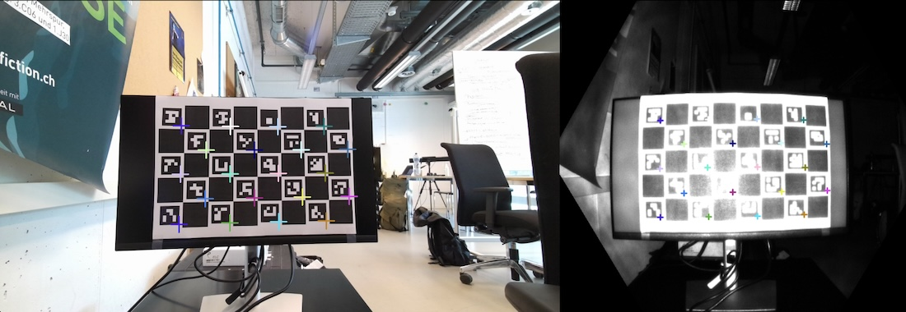

# Open Azure Kinect [](https://pypi.org/project/open-azure-kinect/)

Easy-to-use playback library for Azure Kinect MKV files.



*Calibration Example*

It is possible to playback [Azure Kinect](https://github.com/microsoft/Azure-Kinect-Sensor-SDK) videos files (mkv) without using the official SDK. This allows the software to be used on systems where the depth engine is not implemented, such as MacOS. The library currently **only** supports the **playback** of mkv files and does **not provide direct access** to the Azure Kinect device.

The following functions are currently supported:

- [x] Reading colour, infrared and depth stream from mkv
- [x] Reading and parsing calibration data from mkv
- [/] Image alignment and point transformation (⚠️not as accurate as the Azure Kinect SDK)

## Installation

```terminal
pip install open-azure-kinect
```

## Usage
In order to load an MKV file, it is necessary to create a new instance of the `OpenK4APlayback` class.

```python
from openk4a.playback import OpenK4APlayback

azure = OpenK4APlayback("my-file.mkv")
azure.is_looping = True # set loop option if necessary
azure.open()
```

After that, it is possible to read the available stream information.

```python
for stream in azure.streams:
    print(stream)
```

And read the actual capture information (image data).

```python
while capture := azure.read():
    # read color frame as numpy array
    color_image = capture.color
```

### Calibration Data
To access the calibration data of the two cameras (`Color`, `Depth`), use the parsed information property.

```python
color_calib = azure.color_calibration
depth_calib = azure.depth_calibration
```

### Image and Point Transformations
The class `CameraTransform` handles the transformation task between the different cameras. ⚠️The methods are not as accurate as the Azure Kinect SDK because some optimisations have not been taken into account yet. Please open a PR if you like to improve it.

Be aware that this part of the framework is still very much under development!

```python
import numpy as np
from openk4a.transform import CameraTransform

estimated_depth_mm = 1500  # adjust this value to improve the calculation accuracy
transform = CameraTransform(azure.color_calibration, azure.depth_calibration, estimated_depth_mm)

# transform points from color to depth image
depth_points = transform.transform_2d_color_to_depth(np.array([[300, 400], [200, 200]]))

# transform color image into depth image
transformed_color = transform.align_image_depth_to_color(color_image)
```

## Development and Examples
To run the examples or develop the library please install the `dev-requirements.txt` and `requirements.txt`.

```terminal
pip install -r dev-requirements.txt
pip install -r requirements.txt
```

There is already an example script [demo.py](demo.py) which provides insights in how to use the library.

## About
Copyright (c) 2024 Florian Bruggisser
