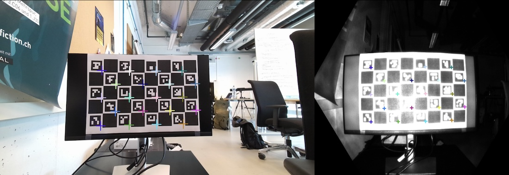

# Open Azure Kinect [](https://pypi.org/project/open-azure-kinect/)

Cross-platform Python playback library for Azure Kinect MKV files.



*Calibration Example*

It is possible to playback [Azure Kinect](https://github.com/microsoft/Azure-Kinect-Sensor-SDK) videos files (mkv) without using the official SDK. This allows the software to be used on systems where the depth engine is not implemented, such as MacOS. The library currently **only** supports the **playback** of mkv files and does **not provide direct access** to the Azure Kinect device.

The following functions are currently supported:

- [x] Reading colour, infrared and depth stream from mkv
- [x] Reading and parsing calibration data from mkv
- [x] Image alignment and point transformation (⚠️ maybe not as accurate as the Azure Kinect SDK)

## Installation

```terminal
pip install open-azure-kinect
```

## Usage
In order to load an MKV file, it is necessary to create a new instance of the `OpenK4APlayback` class. Note that if the `is_looping` flag is set, the stream will not stop playing at the EOF of the stream. It will automatically close and reopen the file.

```python
from openk4a.playback import OpenK4APlayback

azure = OpenK4APlayback("my-file.mkv")
azure.is_looping = True # set loop option if necessary
azure.open()
```

After that, it is possible to read the available stream information.

```python
for stream in azure.streams:
    print(stream)

# print clip duration
print(azure.duration_ms)
```

And read the actual capture information (image data).

```python
while capture := azure.read():
    # read color frame as numpy array
    color_image = capture.color

    # print current timestamp in ms (of the video timeline)
    print(azure.timestamp_ms)
```

### Seek
With `seek(timestamp_ms: int)` it is possible to jump to a specific position in the video. The current implementation is not very efficient as the library just skips frames until the timestamp is reached. In the future, this should be replaced with a ffmpeg controlled seek.

```python
# jump +1 second into the future
azure.seek(azure.timestamp_ms + 1000)
```

### Calibration Data
To access the calibration data of the two cameras (`Color`, `Depth`), use the parsed information property.

```python
color_calib = azure.color_calibration
depth_calib = azure.depth_calibration
```

### Image and Point Transformations
The class `CameraTransform` handles the transformation task between the different cameras.

⚠️ Be aware that this part of the framework is still under development! Please open a PR if you like to improve it.

```python
import numpy as np

from openk4a.transform import CameraTransform

transform = CameraTransform(azure.color_calibration, azure.depth_calibration)

# transform points from color to depth image (using epipolar search)
depth_points = transform.transform_2d_color_to_depth(np.array([[300, 400], [200, 200]]))

# create 3d pointcloud from depthmap
points_3d = transform.create_pointcloud(depth_map)

# transform color image into depth image
transformed_color = transform.align_image_color_to_depth(color, depth_map)
```

## Development and Examples
To run the examples or develop the library please install the `dev-requirements.txt` and `requirements.txt`.

```terminal
pip install -r dev-requirements.txt
pip install -r requirements.txt
```

There is already an example script [demo.py](demo.py) which provides insights on how to use the library.

## About
Thanks to [tikuma-lsuhsc](https://github.com/tikuma-lsuhsc) for creating [python-ffmpegio](https://github.com/python-ffmpegio/python-ffmpegio) and helping me extract the Azure Kinect data.
